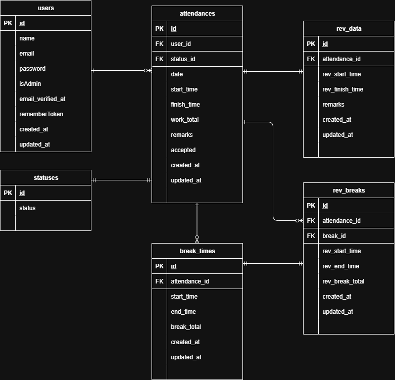

# 勤怠管理アプリ


## 環境構築

### Dockerの起動
 ```bash
git clone git@github.com:mozza20/attendance_management.git
docker-compose up -d --build
```

### Laravelのセットアップ
 ```bash
docker-compose exec php bash  
composer install   
cp .env.example .env  
php artisan key:generate  
```

### 環境変数の設定
```env
DB_CONNECTION=mysql  
DB_HOST=mysql  
DB_PORT=3306  
DB_DATABASE=laravel_db  
DB_USERNAME=laravel_user  
DB_PASSWORD=laravel_pass
``` 

### データベースの初期化
```
php artisan migrate --seed
```
```--seed```でユーザーと勤怠実績のダミーデータを作成します。

## 使用技術
- PHP 8.4.3
- Laravel 8.83.8
- MySQL 8.0.26
- MailHog

## メール認証
mailtrapというツールを使用しています。
1. 会員登録 https://mailtrap.io/
2. Mailbox の Integrations → "Laravel 7.x and 8.x" を選択
3. 表示された設定を .env の MAIL_MAILER ～ MAIL_ENCRYPTION にコピー
4. MAIL_FROM_ADDRESS は任意のメールアドレスを設定  
  

## ER図




## テストアカウント

- 一般ユーザー (未認証)
name:山田 太郎  
email: testuser@example.com  
password: password1234  

- 管理者  
email: admin@example.com  
password: admin2345  

## PHPUnitを利用したテストに関して
以下のコマンド：
```
//テスト用データベースの作成
docker-compose exec mysql bash
mysql -u root -p
//パスワードはrootと入力
create database test_database;

docker-compose exec php bash
php artisan migrate:fresh --env=testing
./vendor/bin/phpunit
```

## ヘルパ関数
`app\helper.php` に、時刻の形式を整形するために独自の関数を定義しています。  
Laravelの`composer.json`でautoload設定済みなので、どこでも呼び出せます。


## URL

- 開発環境： http://localhost/
- phpMyAdmin:： http://localhost:8080/
- Mailhog: http://localhost:8025

